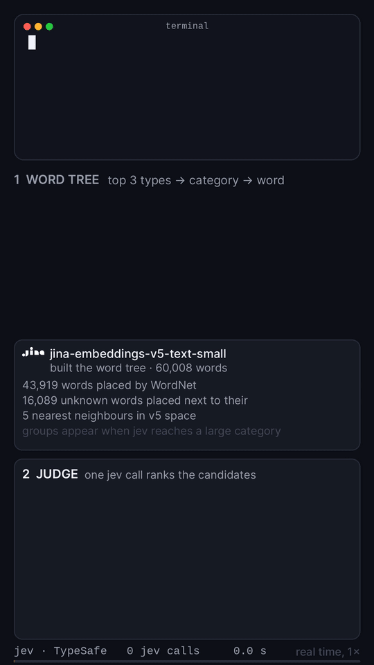

# jev-gpt

Text generation with [jev](https://typesafe.ai), a model that never generates text. jev only answers typed questions
with probabilities. jev-gpt asks it one question per choice: word type, then WordNet category, then a group of ~200
words split by `jina-embeddings-v5-text-small`, then the word, and one more question to rank the candidate texts.

## Run

```bash
export TYPESAFE_API_KEY=...   # https://console.typesafe.ai
./jev-gpt "Think step by step: what is the future of AI models, Jev, Claude or GPT?"
```

```
the future is undetermined. many people belive that some combination will win. most are coexisting now. so it has time.
```

No dependencies beyond Python 3. About 400 jev calls, 90 seconds and 2 cents per prompt.

## How it works, in real time



Full quality: [video/jev-gpt.mp4](video/jev-gpt.mp4)

The video is a guided replay: every call and every probability is real, but the beam was steered to the answer above so it ends there. The judge panel shows the text the terminal follows next to jev's own top picks, so you see where they differ.
